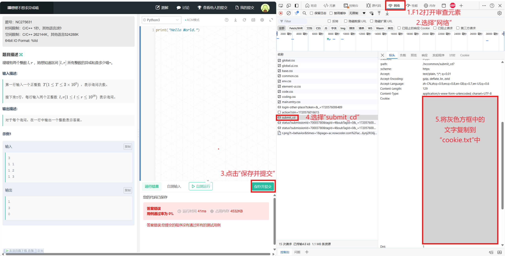

# Nowcoder_RemoteJudge
Nowcoder RemoteJudge is a CLI Remotejudge tool for NowCoder.

## Usage:
1. record your "cookie.txt" using the method below:

3. Edit config.json under the following format:
```
{
    "A":{
    "isPdfContent": false,
    "creatorId": "391696",
    "questionId": "10944456",
    "problemId": "274983",
    "uuid": "d2d4711a6f20490f814e5fc6f2e64aac",
    "tagId": "4",
    "subTagId": "0",
    "doneQuestionId": "274983",
    "selfType": "8",
    "codeJudgeType": "0",
    "supportLang": "java,cpp"
    },
    "B": {
        "isPdfContent": false,
        "creatorId": "391696",
        "questionId": "10954138",
        "problemId": "275593",
        "uuid": "6bda502dd4424ce498095fec27bcb30e",
        "tagId": "4",
        "subTagId": "0",
        "doneQuestionId": "275593",
        "selfType": "8",
        "codeJudgeType": "0",
        "supportLang": "java,cpp"
    }
}
```
the info can be found on the problem page with keyword **questionID**


5. submit using format:
```
NCRMJ.py [code] [-l language] [-p problem]
```

6. Check the standings using format:
```
NCRMJ.py -s [contest_id] [username]
```
