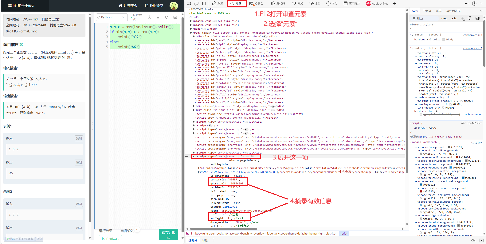

# Nowcoder_RemoteJudge
Nowcoder RemoteJudge is a CLI Remotejudge tool for NowCoder.

## Usage:
1. record your "cookie.txt" using the method below:

3. Edit config.json under the following format:
```
{
    {
    "contestID": 85687,
    "A": {
        "questionId": 10954099,
        "tagId": 4,
        "subTagId": 1
    },
    "B": {
        "questionId": 10954106,
        "tagId": 4,
        "subTagId": 1
    },
    ...
}
```
the info can be found on the problem page with method below:


3. submit using format:

### If you name code file with its index, NCEMJ can automatically detect its Language and Problem ID. 
Sample:
```
NCRMJ.py A.cpp
```
If you want to specify Language or Problem, you can also run:
```
NCRMJ.py [code] [-l language] [-p problem]
```

5. Check the standings using format:
```
NCRMJ.py -s [username]
example: NCRMJ.py -s Clearwave
```
